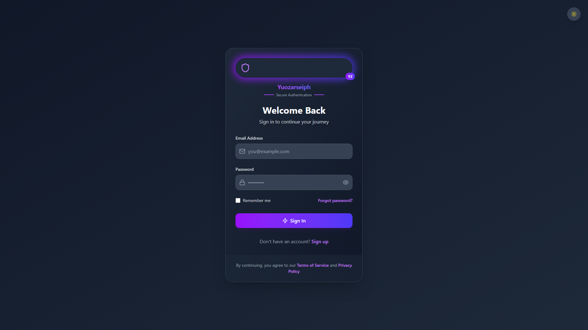

# Yuozarseiph Auth Form

A modern, animated authentication form with login/signup functionality, dark mode support, and creative error handling.

## 🌟 Features

- Modern UI Design with gradient accents
- Smooth animations powered by Framer Motion
- Dark/Light mode toggle
- Creative error notifications
- Form validation with real-time feedback
- Fully responsive design
- Brand integration ("Yuozarseiph")

## 🚀 Quick Start

1. Clone the repository:
```bash
git clone https://github.com/yuozarseiph/auth-form.git
cd auth-form
```
Install dependencies:
```bash
npm install
```
npm run dev
```bash
npm run dev
```
🛠️ Technologies
```bash
React
Tailwind CSS
Framer Motion
Lucide React Icons
```
🎨 Customization
Update Brand Name
Edit the brand text in AuthForm.jsx:

Find "Yuozarseiph" and replace with your brand name
Update the brand badge initials ("YZ")
Change Colors
Modify Tailwind classes:

Replace purple and indigo with your brand colors
Update gradient classes throughout the component
🌗 Dark Mode
Automatic system preference detection
Manual toggle via sun/moon icon
Persists user preference
📱 Responsive
Works on mobile, tablet, and desktop
Adaptive layouts for all screen sizes
🚨 Error Handling
Floating animated notifications
Field-specific validation errors
Visual feedback in form fields
Auto-dismiss after 5 seconds
📄 License
MIT License

👨‍💻 Author
Yousef Shaker
GitHub: @yuozarseiph

## Screenshots

### Login Form


### Signup Form

